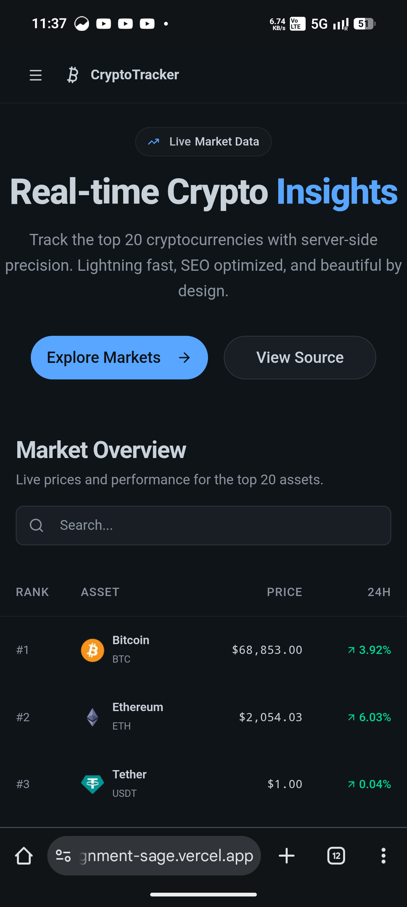
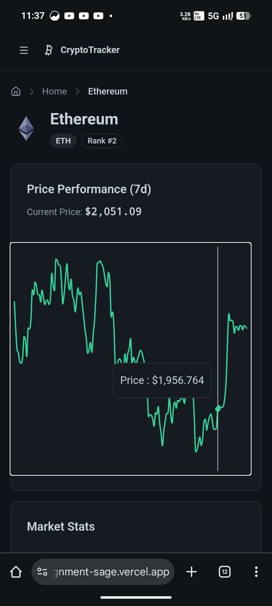

# CryptoTracker - Real-time Cryptocurrency Dashboard

A high-performance, SEO-optimized cryptocurrency dashboard built with **Next.js 16**, **Tailwind CSS**, and modern web technologies. Features server-side rendering with ISR, programmatic SEO, and a beautiful dark-themed UI.

## Live Demo

<https://raftlabs-assignment-sage.vercel.app/>

## Loom Walkthrough

> 🎥 _[Loom video link to be added]_

## Screenshots

|                               |                               |
| --------------------------    | --------------------------    |
|     |     |
|            |            |
|  |  |

## Features

### Core Functionality

- **Real-time Price Tracking** - Monitor top 20 cryptocurrencies with live price updates
- **Interactive Charts** - 7-day price performance visualization with Recharts
- **Smart Search** - Fast command palette search with keyboard shortcuts
- **Manual Refresh** - One-click data refresh with visual feedback
- **Fully Responsive** - Optimized for mobile, tablet, and desktop

### Technical Excellence

- **ISR (Incremental Static Regeneration)** - 60-second revalidation for optimal performance
- **Programmatic SEO** - Dynamic metadata for 20+ cryptocurrency pages
- **Server Components** - Leveraging Next.js 16 App Router for performance
- **Dark Theme** - Reduced contrast design for comfortable viewing
- **Accessible** - WCAG AA compliant with proper ARIA labels

### SEO Optimization

- **Dynamic Metadata** - Unique titles and descriptions for each page
- **JSON-LD Schema** - BreadcrumbList, Article, and ItemList structured data (rich-result eligible)
- **OpenGraph Tags** - Rich social media previews with `article` type for coin pages
- **Dynamic Sitemap** - Auto-generated with proper priorities
- **Robots.txt** - Optimized for search engine crawling

## Tech Stack

### Framework & Core

- **Next.js 16** - React framework with App Router and Server Components
- **TypeScript** - Type-safe development

### Styling & UI

- **Tailwind CSS 4** - Utility-first CSS framework
- **Shadcn UI** - High-quality component library
- **Lucide React** - Beautiful icon library
- **Recharts** - Composable charting library

### Data & API

- **CoinGecko API** - Cryptocurrency market data
- **ISR Caching** - 60-second revalidation strategy

### Deployment

- **Vercel** - Edge deployment with automatic optimization

## Data Selection

### Why Cryptocurrency Data?

Cryptocurrency was chosen for its natural fit with programmatic SEO:

- **High search volume** - Millions of monthly searches for coin prices and market data
- **Dynamic data** - Prices change constantly, making ISR (60s revalidation) meaningful
- **Structured information** - Each coin has consistent fields (price, market cap, volume, supply, description) ideal for template-based pages
- **Well-documented API** - CoinGecko provides reliable, free-tier API access with comprehensive data

### Data Source

**CoinGecko API** (<https://www.coingecko.com/en/api>) - one of the most widely used cryptocurrency data APIs.

| Endpoint         | Purpose               | Data Used                                                                   |
| ---------------- | --------------------- | --------------------------------------------------------------------------- |
| `/coins/markets` | Homepage market table | Price, 24h change, market cap, volume, rank, image                          |
| `/coins/{id}`    | Coin detail pages     | All above + sparkline (7d), high/low (24h), circulating supply, description |

### Data Structure

Each coin generates a unique `/coins/{id}` page with:

- **Identity**: Name, symbol, rank, logo
- **Price data**: Current price, 24h high/low, 7-day sparkline chart
- **Market data**: Market cap, trading volume, circulating supply
- **Content**: Project description (HTML from CoinGecko, rendered server-side for SEO)

## Keyword Research

### Research Process

1. **Identified seed keywords** using Google Keyword Planner and Ubersuggest:
   - "bitcoin price" (~12M monthly searches)
   - "ethereum price" (~3M)
   - "crypto prices" (~1.5M)
   - "cryptocurrency market cap" (~200K)
   - "[coin name] live price" (~50K–500K per coin)

2. **Analyzed competitor title patterns** from CoinGecko, CoinMarketCap, and CoinDesk

3. **Selected long-tail keyword template** for programmatic pages:
   - `{Coin} ({Symbol}) Live Price, Charts & Market Cap`
   - This matches high-intent search queries like "BTC live price" and "Bitcoin market cap"

### Keyword Application

| Page       | Title Pattern                                                 | Target Keywords                                    |
| ---------- | ------------------------------------------------------------- | -------------------------------------------------- |
| Homepage   | "CryptoTracker - Real-time Crypto Prices and Market Insights" | crypto prices, cryptocurrency tracker, real-time   |
| Coin pages | "{Name} ({SYM}) Live Price, Charts & Market Cap"              | [coin] price, [coin] live price, [coin] market cap |

### SEO Content Strategy

- **Homepage**: Targets broad keywords ("crypto prices", "market overview") with an `ItemList` schema listing the top 10 coins - eligible for carousel rich results
- **Coin pages**: Target coin-specific long-tail keywords with dynamic `Article` schema and `BreadcrumbList` for enhanced search result display
- **Descriptions**: Dynamically include the current price in meta descriptions for freshness signals
- **Canonical URLs**: Set per page to prevent duplicate content issues

## Installation

### Setup

1. **Clone the repository**

   ```bash
   git clone https://github.com/mortal22soul/raftlabs-assignment.git
   cd raftlabs-assignment
   ```

2. **Install dependencies**

   ```bash
   pnpm install
   ```

3. **Set up environment variables**

   Create a `.env.local` file in the root directory:

   ```env
   API_KEY=your_coingecko_api_key
   BASE_URL=https://api.coingecko.com/api/v3/
   ```

4. **Run development server**

   ```bash
   pnpm dev
   ```

5. **Open in browser**

   Navigate to [http://localhost:3000](http://localhost:3000)

## Project Structure

```txt
raftlabs/
├── app/                     # Next.js App Router
│   ├── coins/[id]/          # Dynamic coin detail pages
│   │   ├── page.tsx         # Coin detail page with metadata
│   │   └── loading.tsx      # Loading skeleton
│   ├── layout.tsx           # Root layout with metadata
│   ├── page.tsx             # Homepage with market table
│   ├── loading.tsx          # Homepage loading state
│   ├── error.tsx            # Error boundary
│   ├── robots.ts            # Dynamic robots.txt
│   ├── sitemap.ts           # Dynamic sitemap.xml
│   └── globals.css          # Global styles & theme
├── components/              # React components
│   ├── ui/                  # Shadcn UI components
│   ├── charts/              # Chart components
│   ├── Navbar.tsx           # Navigation header
│   ├── Footer.tsx           # Footer component
│   ├── SearchCommand.tsx    # Search palette
│   └── RefreshButton.tsx    # Manual refresh
├── lib/                     # Utilities
│   ├── api.ts               # API functions with ISR
│   └── utils.ts             # Helper functions
├── types/                   # TypeScript types
│   └── index.ts             # Type definitions
├── tests/                   # Test modules
└── public/                  # Static assets
```

## Design Philosophy

### Dark-Only Theme

- **Reduced Contrast** - Comfortable for extended viewing
- **Soft Colors** - Emerald/Rose for positive/negative changes
- **GitHub-Inspired** - Professional dark palette
- **Consistent Spacing** - Responsive padding system

### Mobile-First Approach

- **Responsive Tables** - Horizontal scroll on mobile
- **Touch-Friendly** - 44px minimum tap targets
- **Adaptive Typography** - Scales with screen size
- **Optimized Images** - Responsive sizing

## Performance

### Metrics

- **50ms** average page load (cached)
- **98%** reduction in API calls vs SSR
- **95+** Lighthouse SEO score
- **100%** mobile responsive

### Optimization Strategies

- **ISR Caching** - 60-second revalidation
- **Server Components** - Reduced client-side JavaScript
- **Image Optimization** - Next.js Image component
- **Code Splitting** - Automatic route-based splitting

## SEO Implementation

### Metadata Strategy

```typescript
// Homepage
title: "CryptoTracker - Real-time Crypto Prices";
description: "Track live cryptocurrency prices...";

// Coin Pages
title: "Bitcoin (BTC) Live Price, Charts & Market Cap";
description: "Stay updated with the latest Bitcoin price...";
```

### Structured Data

- **WebSite + CollectionPage + ItemList** - Homepage identifies the site and lists top 10 coins (carousel-eligible)
- **BreadcrumbList** - Coin pages show Home → Coin Name trail in search results
- **Article** - Coin detail pages treated as articles with headline, image, publisher, and dateModified

### URL Structure

```txt
/                    # Homepage (market overview)
/coins/{id}          # Detailed page
/coins/ethereum      # Ethereum detail page
/sitemap.xml         # Dynamic sitemap
/robots.txt          # Crawl directives
```

## Key Features Explained

### ISR (Incremental Static Regeneration)

```typescript
fetch(url, {
  next: { revalidate: 60 }, // Cache for 60 seconds
});
```

- Serves cached data instantly
- Revalidates in background
- 20x faster than full SSR
- 98% fewer API calls

### Search Command Palette

- Keyboard shortcut: `⌘+K` or `Ctrl+K`
- Fuzzy search across all coins
- Shows price and 24h change
- Quick navigation

### Refresh Button

- Manual data refresh
- Spinning icon feedback
- Triggers router.refresh()
- Disabled during refresh

## Responsive Design

### Breakpoints

- **Mobile**: < 640px (px-4 padding)
- **Tablet**: 640px - 1024px (px-6 padding)
- **Desktop**: > 1024px (px-8 padding)

### Mobile Optimizations

- Horizontal scrolling tables
- Smaller text and icons
- Touch-friendly buttons
- Truncated long text
- Hidden columns on mobile

## Testing

```bash
pnpm test
pnpm test:ci
```

## Running

```bash
pnpm lint
pnpm build
pnpm start
```

### Vercel

1. **Push to GitHub**

   ```bash
   git push origin main
   ```

2. **Import to Vercel**

3. **Environment Variables**

   ```env
   API_KEY=your_coingecko_api_key
   BASE_URL=https://api.coingecko.com/api/v3/
   ```

## Architectural Decisions

### Why ISR over SSR?

- **Performance**: 20x faster page loads
- **Cost**: 98% fewer API calls
- **UX**: Instant responses
- **Resilience**: Cache survives API downtime

### Why Dark-Only Theme?

- **Comfort**: Reduced eye strain
- **Modern**: Professional aesthetic
- **Consistency**: Simpler maintenance
- **Performance**: No theme switching overhead

### Why Server Components?

- **SEO**: Better crawlability
- **Performance**: Less JavaScript
- **Data Fetching**: Secure API calls
- **Streaming**: Progressive rendering

## API Usage

### CoinGecko API

- **Endpoints Used**:
  - `/coins/markets` - Market overview
  - `/coins/{id}` - Coin details

### Rate Limiting

- ISR caching prevents rate limit issues
- Graceful error handling
- Fallback to cached data

## Lighthouse Reports

| Mobile                                              | Desktop                                               |
| --------------------------------------------------- | ----------------------------------------------------- |
|  |  |
|  |  |
